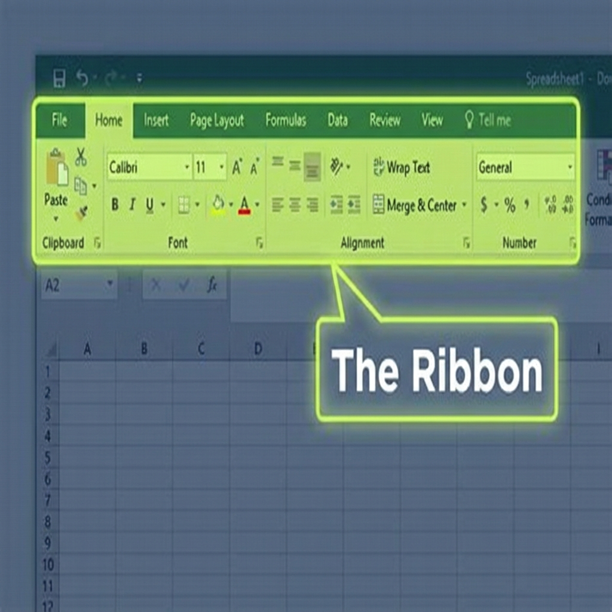
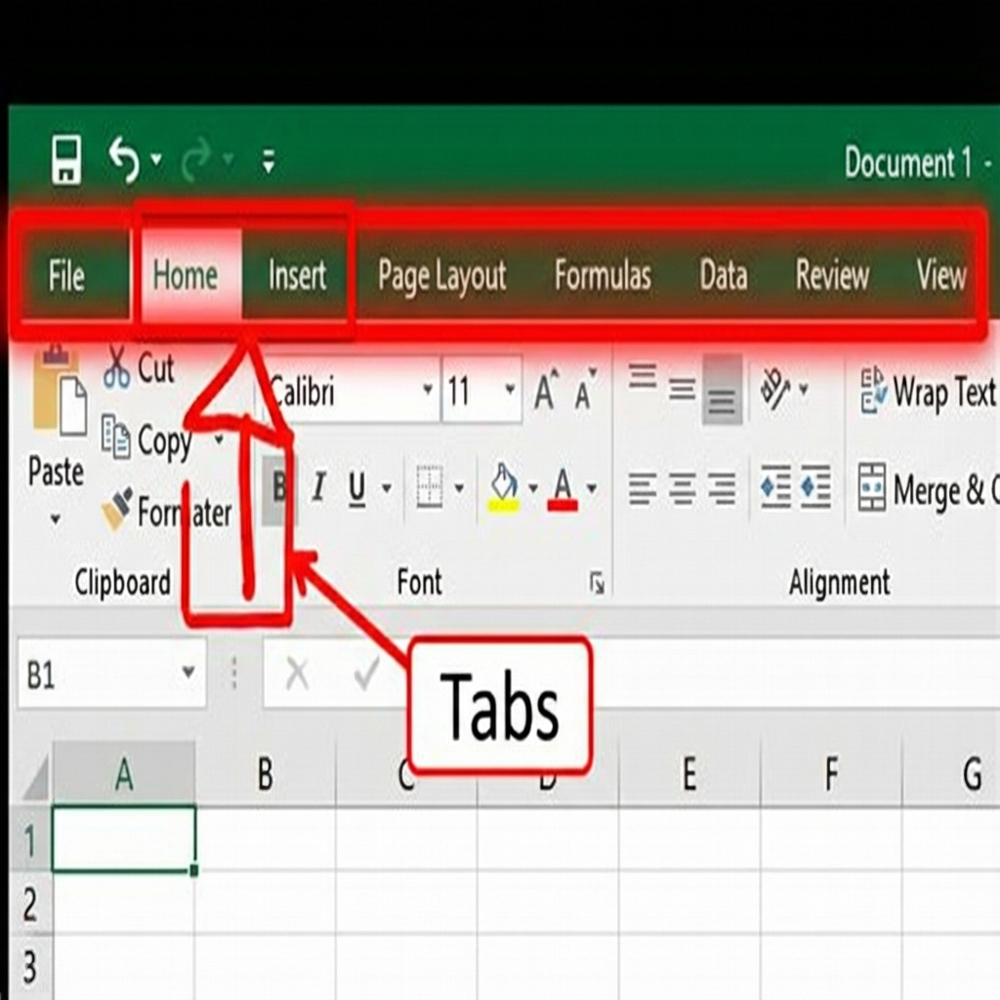
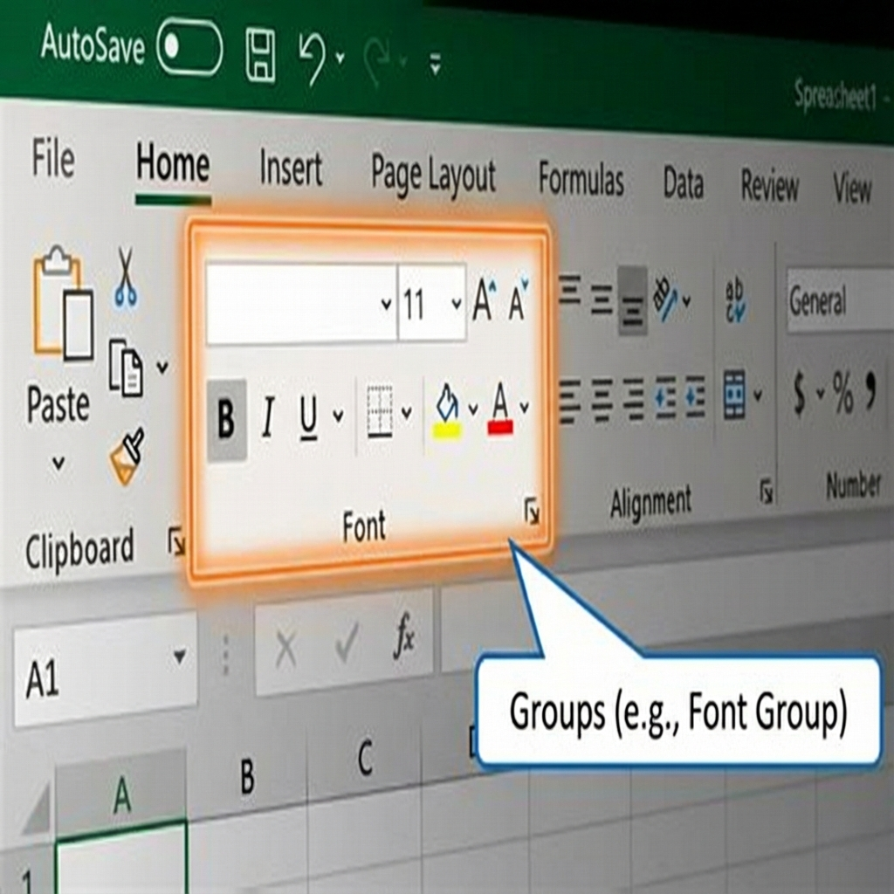
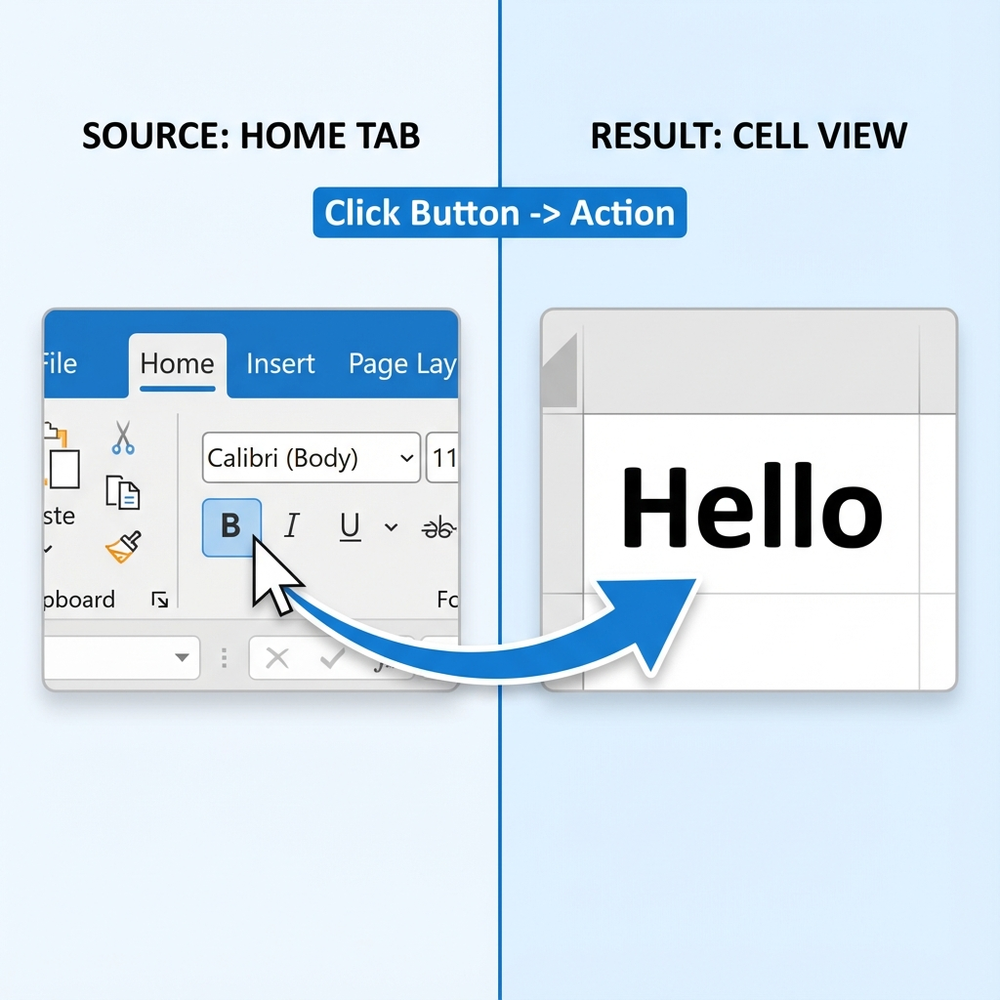
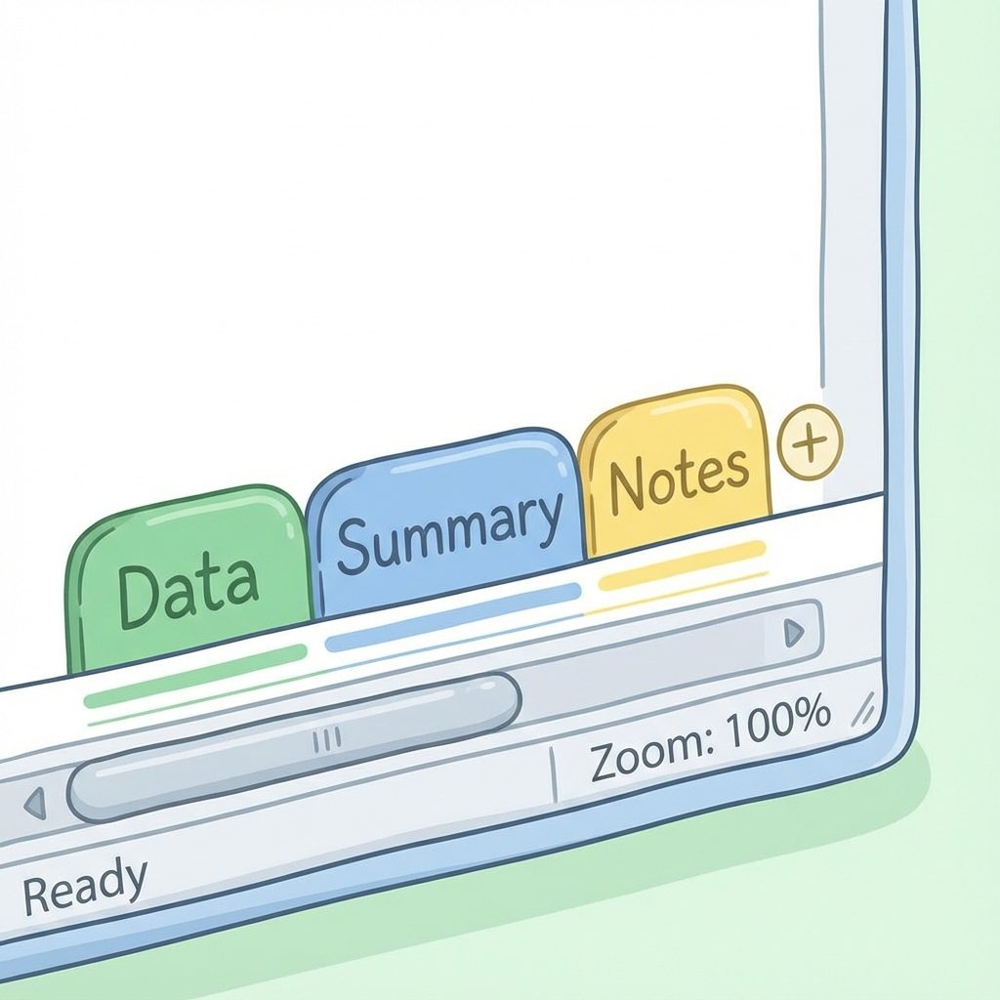
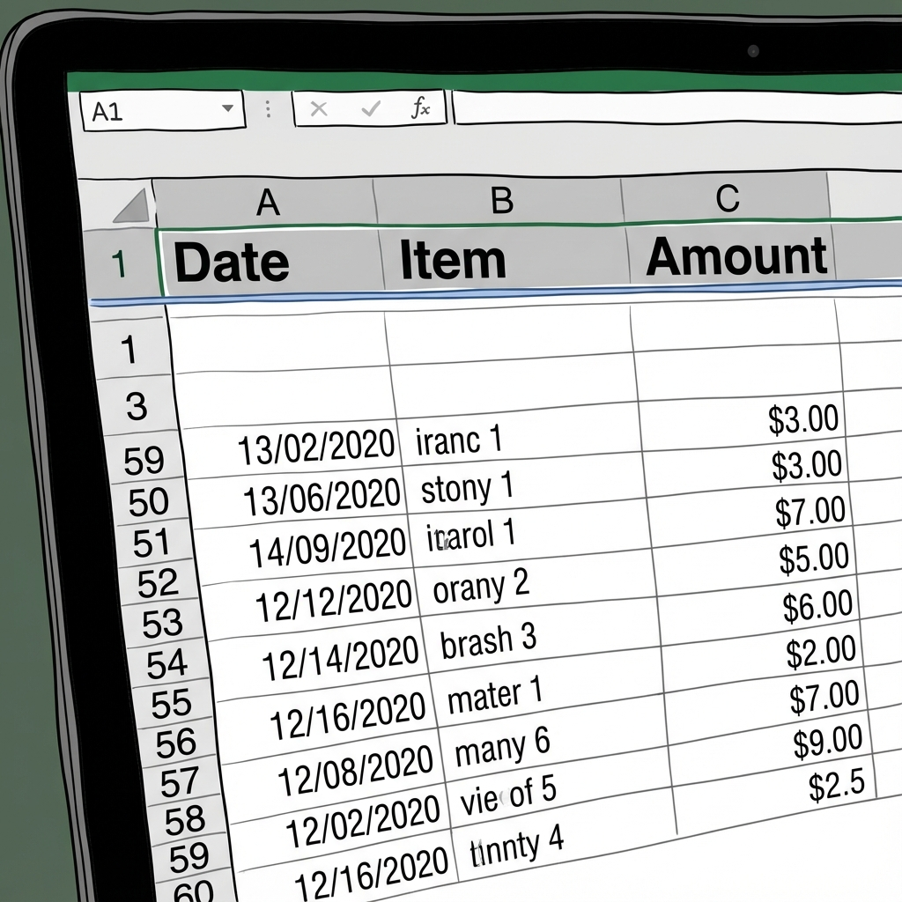

# Day 1: Excel Interface & Workbook Management

Welcome to Day 1! Today is about getting comfortable with the "kitchen" (Excel) before we start cooking (analyzing data).

## 1. The Excel Interface (The Kitchen Layout)

Let's break down the most important part of Excel: **The Ribbon**. This is where all your tools live.

### Step 1: Locate the Ribbon
The **Ribbon** is the wide strip at the very top of your window. It contains every button you need.

### Step 2: Understanding Tabs
The Ribbon is divided into **Tabs** (like pages in a menu).
*   **Home**: The main tab. Contains Font, Color, Cut/Copy/Paste.
*   **Insert**: For adding things (Charts, Pictures).
*   **Data**: For sorting and filtering.

### Step 3: Groups
Inside each Tab, buttons are organized into **Groups**.
*   Look at the **Home** tab.
*   See the **Font** group? It keeps all text tools together (Bold, Italic, Color).

### Step 4: Using a Button (Example: Making Text Bold)
How do you actually use it?
1.  Click on a cell with text.
2.  Go to the **Home** tab.
3.  Look in the **Font** group.
4.  Click the **B** (Bold) button.

## 2. Workbook vs. Worksheet

*   **Workbook**: The entire Excel file (`.xlsx`). Think of it as a **Notebook**.
*   **Worksheet**: The individual tabs at the bottom (Sheet1, Sheet2). Think of them as **Pages** in the notebook.

## 3. Managing Sheets (Organizing Your Pages)

You will often have multiple sheets for different things (e.g., "Jan Sales", "Feb Sales").

*   **Add a Sheet**: Click the `+` button next to the sheet tabs at the bottom.
*   **Rename a Sheet**: **Double-click** the tab name (e.g., "Sheet1") and type a new name.
*   **Color Code**: **Right-click** a tab > **Tab Color**. This helps distinguish important sheets.
*   **Move**: Click and drag a tab left or right to rearrange.
*   **Delete**: Right-click > Delete. (Careful! You can't undo this easily).

## 4. Navigation & Viewing (Seeing Clearly)

*   **Zoom**: Bottom right corner slider. Or hold `Ctrl` and scroll your mouse wheel.
*   **Freeze Panes** (Super Important!):
    *   Imagine you have a list of 1000 rows. When you scroll down, you lose the header row (Name, Date, Price).
    *   **How to fix**: Go to **View** Tab > **Freeze Panes** > **Freeze Top Row**.
    *   Now, line 1 stays stuck at the top while you scroll!

---

## 🎓 Day 1 Exercise: "My First Setup"

Open a blank Excel workbook and do the following:

1.  **Save** the file as `Day_1_Practice.xlsx`.
2.  **Create 3 Sheets**:
    *   Rename Sheet 1 to **"Data"**.
    *   Rename Sheet 2 to **"Summary"**.
    *   Rename Sheet 3 to **"Notes"**.
3.  **Color Code**:
    *   Make "Data" **Green**.
    *   Make "Summary" **Blue**.
    *   Make "Notes" **Yellow**.
4.  **Enter Data**:
    *   Go to the **"Data"** sheet.
    *   In cell **A1**, type `Date`.
    *   In cell **B1**, type `Item`.
    *   In cell **C1**, type `Amount`.
5.  **Freeze It**:
    *   Scroll down to row 50 (just to see the top disappear).
    *   Go back up. Go to **View** > **Freeze Panes** > **Freeze Top Row**.
    *   Scroll down again. Notice how `Date`, `Item`, `Amount` stay visible?

## End of Day 1

**Day 2 → Basic Formulas (SUM, AVERAGE, COUNT)**

