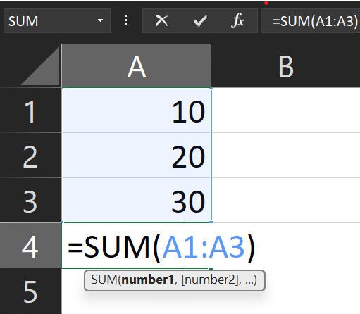
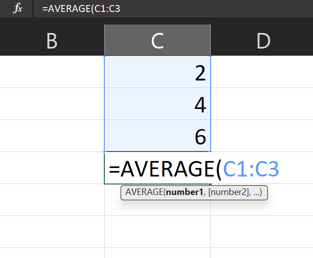

# Day 2: Basic Formulas (SUM, AVERAGE, COUNT)

Welcome to Day 2! Today we start "cooking" with data. We will learn how to do math automatically using **Formulas**.

## 1. What is a Formula?
A formula is just an instruction for Excel.
*   **ALWAYS** starts with an equals sign (`=`).
*   If you type `1 + 1`, Excel shows text "1 + 1".
*   If you type `=1 + 1`, Excel calculates `2`.

## 2. The Formula Bar
The **Formula Bar** is the long white bar above your grid letters (A, B, C...).
*   **Cell**: Shows the *result* (e.g., 60).
*   **Formula Bar**: Shows the *recipe* (e.g., `=20+40`).

---

## 3. The Big 3 Formulas

### A. SUM (Adding things up)
Instead of typing `=A1+A2+A3...`, we use `SUM`.

**Syntax:** `=SUM(Start:End)`

**Result in A4:** `60`

### B. AVERAGE (Finding the middle)
Calculates the average of a list of numbers.

**Syntax:** `=AVERAGE(Start:End)`

**Result in B4:** `4` (Because 2+4+6 = 12, and 12 / 3 items = 4)

### C. COUNT vs. COUNTA (Counting items)
This confuses many people, so let's clear it up.

*   **COUNT**: Counts only **Numbers**.
*   **COUNTA**: Counts **Anything** (Text, Numbers, Symbols) - Think "Count All".

**Example:**

| Row | C (Data) |
| :--- | :--- |
| 1 | 100 |
| 2 | Apple |
| 3 | 200 |

*   `=COUNT(C1:C3)` → Result: **2** (It only sees 100 and 200).

---

## 🎓 Day 2 Exercise: "The Grocery List"

1.  Open your workbook (or a new sheet).
2.  Create a list of groceries with prices:
    *   A1: `Item`, B1: `Price`
    *   A2: `Milk`, B2: `3`
    *   A3: `Bread`, B3: `2`
    *   A4: `Eggs`, B4: `5`
    *   A5: `Juice`, B5: `5`
3.  **Calculate Total Cost**:
    *   In cell **B6**, type `=SUM(B2:B5)`. (Should be 15).
4.  **Calculate Average Price**:
    *   In cell **B7**, type `=AVERAGE(B2:B5)`. (Should be 3.75).
5.  **Count Items**:
    *   In cell **B8**, type `=COUNTA(A2:A5)`. (Should be 4).

## End of Day 2

**Day 3 → Logical Functions (IF, AND, OR)**
