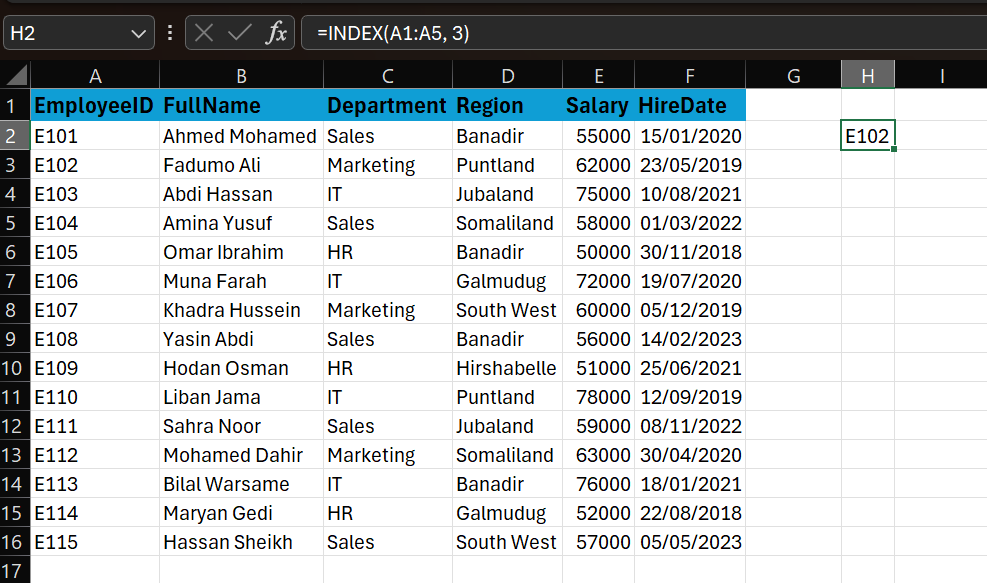
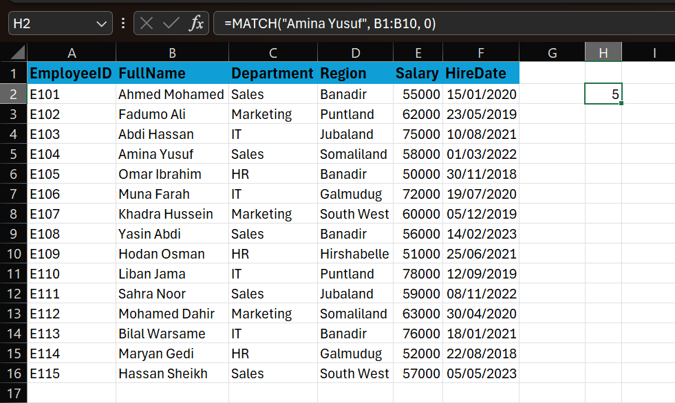
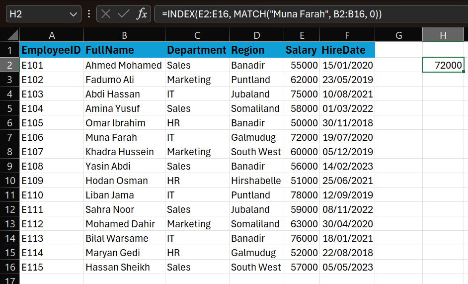
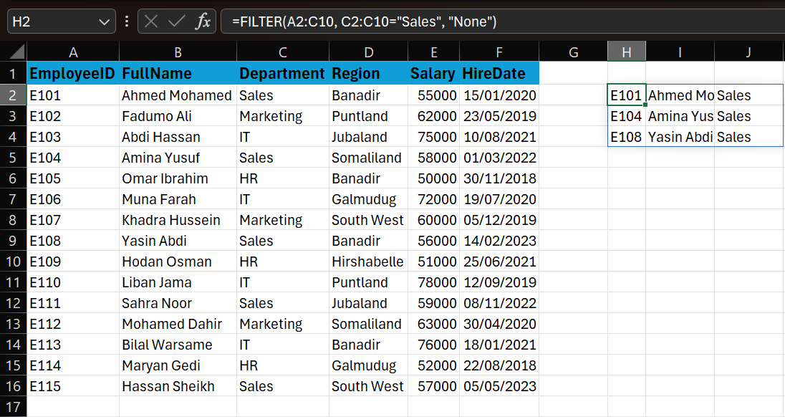
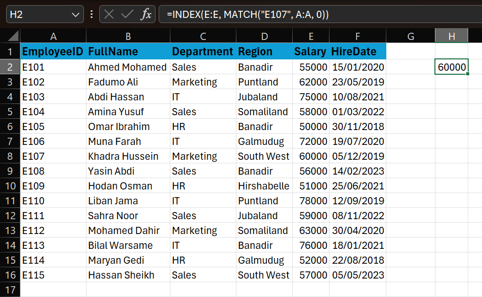
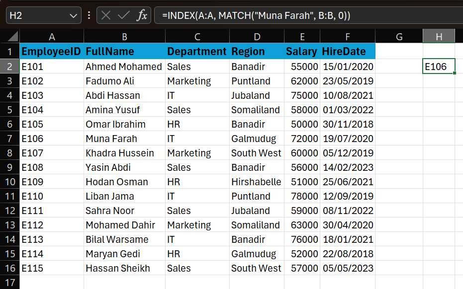
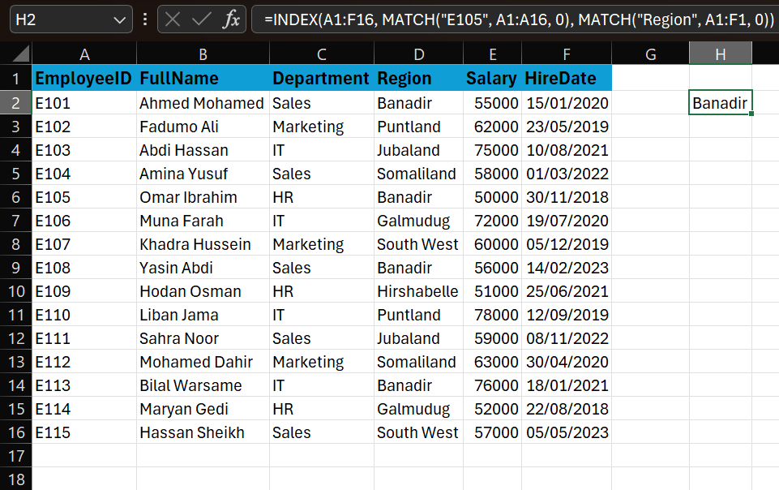
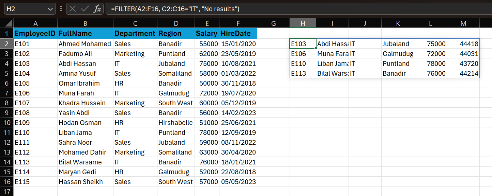
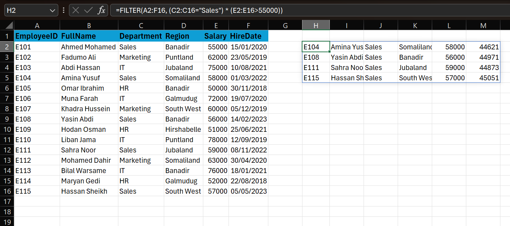

# Day 22: Advanced Lookups (INDEX+MATCH, FILTER)

While `VLOOKUP` and `XLOOKUP` are great, `INDEX` + `MATCH` is the classic "power user" combination that provides ultimate flexibility, especially in older Excel versions. `FILTER` is a modern dynamic array function that changes the game for retrieving multiple results.

## 1. The INDEX Function
**Concept**: Returns the value at a specific row and column in a range.  
**Syntax**: `=INDEX(array, row_num, [column_num])`

*   **Array**: The range of cells to look in.
*   **Row_num**: The row number in the array to get the value from.
*   **Column_num** (Optional): The column number in the array.

**Example**:
If A1:A5 contains specific names, 
`=INDEX(A1:A5, 3)` returns the name in the 3rd cell.


## 2. The MATCH Function
**Concept**: Returns the *position* (number) of an item in a range.  
**Syntax**: `=MATCH(lookup_value, lookup_array, [match_type])`

*   **Lookup_value**: What you are looking for.
*   **Lookup_array**: Where you are looking.
*   **Match_type**: `0` for exact match (most common).

**Example**:
`=MATCH("Amina Yusuf", B1:B10, 0)` might return `5` if Amina Yusuf is in the 5th cell.


## 3. The Power Combo: INDEX + MATCH
Combine them! use MATCH to find the *row number* for INDEX.

**Syntax**:
```excel
=INDEX(return_range, MATCH(lookup_value, lookup_range, 0))
```


**Why use it?**
1.  **Left Lookup**: Can look up values to the left of the lookup column (VLOOKUP cannot).
2.  **Resilience**: Adding or deleting columns won't break it (unlike VLOOKUP's static column index).
3.  **Speed**: Often faster on huge datasets.

## 4. The FILTER Function (Office 365 / Excel 2021+)
**Concept**: Filters a range of data based on criteria and returns *all* matching results (spills into adjacent cells).  
**Syntax**: `=FILTER(array, include, [if_empty])`

*   **Array**: The range to filter.
*   **Include**: The logical test (e.g., `C2:C10="Sales"`).
*   **If_empty**: Text to show if no results found (e.g., "No match").

**Example**:
`=FILTER(A2:C10, C2:C10="Sales", "None")`
Returns all rows from A2:C10 where column B is "Sales".


## Practice Exercises

**Setup**:
1.  Open `Dec 22 — Advanced Lookups.csv` in Excel.
2.  Format the data as a range or Table.

### Exercise 1: Basic INDEX+MATCH
*   **Goal**: Find the **Salary** for Employee ID `E107`.
*   **Steps**:
    1.  Use MATCH to find the row of `E107` in column A.
    2.  Use INDEX to retrieve the value from column E (Salary) using that row.
*   **Formula**: `=INDEX(E:E, MATCH("E107", A:A, 0))`


### Exercise 2: Left Lookup (Reverse)
*   **Goal**: Find the **ID** of the employee named "Muna Farah".
*   **Challenge**: Name is in Col B, ID is in Col A (Left). VLOOKUP can't do this easily.
*   **Formula**: `=INDEX(A:A, MATCH("Muna Farah", B:B, 0))`


### Exercise 3: 2-Way Lookup (Index + Match + Match)
*   **Goal**: Create a dynamic lookup where you type an ID in one cell and a "Header Name" (like Salary, Dept) in another, and it finds the value.
*   **Hint**: Use one MATCH for row, another MATCH for column.
*   **Formula**: `=INDEX(A1:F16, MATCH("E105", A1:A16, 0), MATCH("Region", A1:F1, 0))`


### Exercise 4: Simple FILTER
*   **Goal**: Return a list of all employees in the **"IT"** Department.
*   **Formula**: `=FILTER(A2:F16, C2:C16="IT", "No results")`


### Exercise 5: Complex FILTER (Multiple Criteria)
*   **Goal**: Find all employees in **"Sales"** who earn **> 55000**.
*   **Hint**: Use `*` for AND logic.
*   **Formula**: `=FILTER(A2:F16, (C2:C16="Sales") * (E2:E16>55000))`


## Pro Tip
`XLOOKUP` (Day 4) effectively replaced `INDEX+MATCH` for most single-value lookups, but understanding `INDEX+MATCH` is crucial for:
1.  Legacy spreadsheets.
2.  Complex 2D lookups (Matrix lookups).
3.  Situations requiring complex array manipulations.


