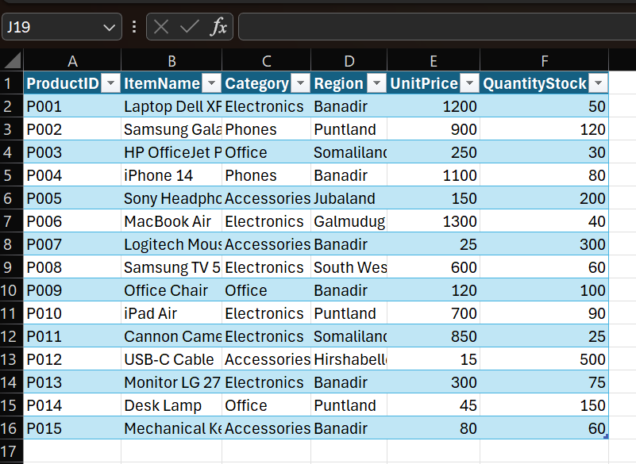

# Day 23: Excel Tables & Structured References

Excel Tables (Ctrl + T) are more than just fancy formatting. They transform a range of cells into a structured object that simplifies data management.

## 1. Creating a Table
1.  Click anywhere inside your data range.
2.  Press **Ctrl + T**.
3.  Ensure "My table has headers" is checked.
4.  Click OK.

You now have a "Table" (default name `Table1`). You can rename it in the **Table Design** tab (e.g., `Inventory`).

## 2. Key Features
*   **Auto-Expansion**: If you type data in the row below the table, the table automatically expands to include it.
*   **Total Row**: Check the "Total Row" box in the **Table Design** tab to instantly add sums, averages, counts, etc., at the bottom.
*   **Banded Rows**: Automatic alternating colors for readability.
*   **Filter Buttons**: Automatically added to headers.

## 3. Structured References
When you write formulas inside a table, Excel uses column names instead of cell addresses (e.g., `A2`). This is called a "Structured Reference".

**Legacy Formula**: `=E2*F2`  
**Structured Formula**: `=[@UnitPrice] * [@QuantityStock]`

**Benefits**:
*   **Readability**: You immediately know what the formula does.
*   **Consistency**: The formula is automatically copied to the entire column.

## 4. Slicers
Slicers are visual buttons for filtering.
1.  Click inside your table.
2.  Go to **Insert** > **Slicer**.
3.  Choose a column (e.g., "Region").
4.  Click buttons to filter the table instantly.

## Practice Exercises

**Setup**:
1.  Open `Dec 23 — Excel Tables.csv`.
2.  Select the data and press **Ctrl + T** to make it a Table.

### Exercise 1: Calculated Columns
*   **Goal**: Calculate the **Total Value** of the stock.
*   **Action**: In cell G1, type `Total Value`. A new column is created.
*   **Formula**: Type `=` then click cell E2 (`UnitPrice`) `*` click cell F2 (`QuantityStock`).
*   **Result**: Formula becomes `=[@UnitPrice]*[@QuantityStock]` and fills down automatically.

### Exercise 2: The Total Row
*   **Goal**: Find the total value of all inventory.
*   **Action**:
    1.  Go to **Table Design** tab.
    2.  Check **Total Row**.
    3.  Click the cell at the bottom of the "Total Value" column.
    4.  Select `SUM` from the dropdown.

### Exercise 3: Slicing by Region
*   **Goal**: View only stock in **Banadir**.
*   **Action**:
    1.  Insert a Slicer for **Region**.
    2.  Click "Banadir".
    3.  Observe how the "Total Row" updates to show only the sum for Banadir.

### Exercise 4: Dynamic Updates
*   **Goal**: Add a new item.
*   **Action**:
    1.  Go to the bottom of the table.
    2.  Add a new item: `P016, Smart Watch, Electronics, Banadir, 150, 10`.
    3.  Notice how the Table formatting and formulas (Total Value) automatically extend to this new row.
