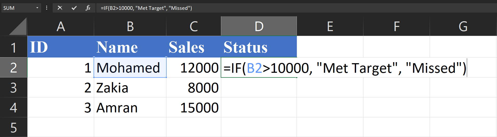
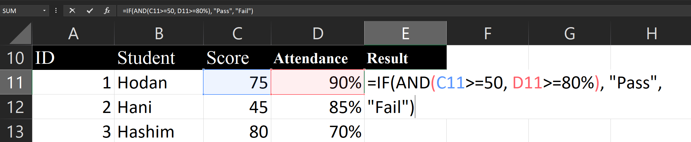
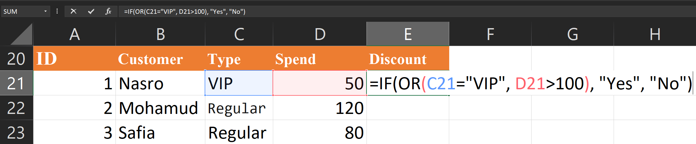

# Day 3: Logical Functions (IF, AND, OR)

## 1. The IF Function
The `IF` function is one of the most popular functions in Excel. It allows you to make logical comparisons between a value and what you expect.

**Syntax:**
```excel
=IF(logical_test, value_if_true, [value_if_false])
```

*   **logical_test**: The condition you want to check (e.g., `A1 > 10`).
*   **value_if_true**: The value to return if the condition is met.
*   **value_if_false**: (Optional) The value to return if the condition is NOT met.

**Example:**
Imagine you have a list of student scores. You want to mark "Pass" if the score is 60 or above, and "Fail" otherwise.
```excel
=IF(B2>=60, "Pass", "Fail")
```

## 2. The AND Function
The `AND` function returns TRUE if *all* its arguments evaluate to TRUE, and returns FALSE if one or more arguments evaluate to FALSE. It is often used inside an `IF` function.

**Syntax:**
```excel
=AND(logical1, [logical2], ...)
```

**Example:**
To pass, a student must have a score >= 60 **AND** attendance >= 80%.
```excel
=IF(AND(B2>=60, C2>=80%), "Pass", "Fail")
```

## 3. The OR Function
The `OR` function returns TRUE if *any* of its arguments evaluate to TRUE, and returns FALSE only if *all* arguments evaluate to FALSE.

**Syntax:**
```excel
=OR(logical1, [logical2], ...)
```

**Example:**
A student gets a bonus if they sold more than 100 units **OR** their customer satisfaction score is > 4.5.
```excel
=IF(OR(B2>100, C2>4.5), "Bonus", "No Bonus")
```

## 4. Nested IFs (IFS Function)
Sometimes you need to check multiple conditions. You can nest `IF` functions inside each other, or use the newer `IFS` function (available in Excel 2019 and Office 365).

**Nested IF Example:**
*   Score >= 90: "A"
*   Score >= 80: "B"
*   Else: "C"

```excel
=IF(B2>=90, "A", IF(B2>=80, "B", "C"))
```

**IFS Example:**
```excel
# Day 3: Logical Functions (IF, AND, OR)

## 1. The IF Function
The `IF` function is one of the most popular functions in Excel. It allows you to make logical comparisons between a value and what you expect.

**Syntax:**
```excel
=IF(logical_test, value_if_true, [value_if_false])
```

*   **logical_test**: The condition you want to check (e.g., `A1 > 10`).
*   **value_if_true**: The value to return if the condition is met.
*   **value_if_false**: (Optional) The value to return if the condition is NOT met.

**Example:**
Imagine you have a list of student scores. You want to mark "Pass" if the score is 60 or above, and "Fail" otherwise.
```excel
=IF(B2>=60, "Pass", "Fail")
```

## 2. The AND Function
The `AND` function returns TRUE if *all* its arguments evaluate to TRUE, and returns FALSE if one or more arguments evaluate to FALSE. It is often used inside an `IF` function.

**Syntax:**
```excel
=AND(logical1, [logical2], ...)
```

**Example:**
To pass, a student must have a score >= 60 **AND** attendance >= 80%.
```excel
=IF(AND(B2>=60, C2>=80%), "Pass", "Fail")
```

## 3. The OR Function
The `OR` function returns TRUE if *any* of its arguments evaluate to TRUE, and returns FALSE only if *all* arguments evaluate to FALSE.

**Syntax:**
```excel
=OR(logical1, [logical2], ...)
```

**Example:**
A student gets a bonus if they sold more than 100 units **OR** their customer satisfaction score is > 4.5.
```excel
=IF(OR(B2>100, C2>4.5), "Bonus", "No Bonus")
```

## 4. Nested IFs (IFS Function)
Sometimes you need to check multiple conditions. You can nest `IF` functions inside each other, or use the newer `IFS` function (available in Excel 2019 and Office 365).

**Nested IF Example:**
*   Score >= 90: "A"
*   Score >= 80: "B"
*   Else: "C"

```excel
=IF(B2>=90, "A", IF(B2>=80, "B", "C"))
```

**IFS Example:**
```excel
=IFS(B2>=90, "A", B2>=80, "B", TRUE, "C")
```
*Note: The `TRUE` at the end acts as a "catch-all" or "else" condition.*

---

## Hands-on Practice: Step-by-Step

Copy these tables into Excel to practice.

### 1. The IF Function (Simple Condition)
**Scenario:** Check if a salesperson met their target of $10,000.

|   | A           | B      | C      |
|---|-------------|--------|--------|
| **ID** | **Name**    | **Sales** | **Status** |
| 1 | Mohamed     | 12000  |        |
| 2 | Zakia       | 8000   |        |
| 3 | Amran       | 15000  |        |

*   **Goal:** In column C, display "Met Target" if Sales > 10000, otherwise "Missed".
*   **Formula for C2:** `=IF(B2>10000, "Met Target", "Missed")`

*   **Expected Result:**
    *   Mohamed: Met Target
    *   Zakia: Missed
    *   Amran: Met Target

### 2. The AND Function (All Conditions Must Be True)
**Scenario:** A student passes only if they score >= 50 **AND** have attendance >= 80%.

|   | A       | B     | C          | D      |
|---|---------|-------|------------|--------|
| **ID** | **Student** | **Score** | **Attendance** | **Result** |
| 1 | Hodan   | 75    | 90%        |        |
| 2 | Hani     | 45    | 85%        |        |
| 3 | Hashim | 80    | 70%        |        |

*   **Goal:** In column D, check if they pass.
*   **Formula for E11:** `=IF(AND(C11>=50, D11>=80%), "Pass", "Fail")`

*   **Expected Result:**
    *   Hodan: Pass (Both true)
    *   Hani: Fail (Score too low)
    *   Hashim: Fail (Attendance too low)

### 3. The OR Function (At Least One Condition True)
**Scenario:** Give a discount if the customer is a "VIP" **OR** spends more than $100.

|   | A        | B          | C       | D        |
|---|----------|------------|---------|----------|
| **ID** | **Customer** | **Type**   | **Spend** | **Discount** |
| 1 | Nasro      | VIP        | 50      |          |
| 2 | Mohamud    | Regular    | 120     |          |
| 3 | Safia    | Regular    | 80      |          |

*   **Goal:** In column D, display "Yes" if eligible, "No" if not.
*   **Formula for E21:** `=IF(OR(C21="VIP", D21>100), "Yes", "No")`

*   **Expected Result:**
    *   Nasro: Yes (Is VIP)
    *   Mohamud: Yes (Spend > 100)
    *   Safia: No (Neither condition met)

---
## End of Day 3

**Day 4 → Lookup Functions (VLOOKUP, XLOOKUP)**