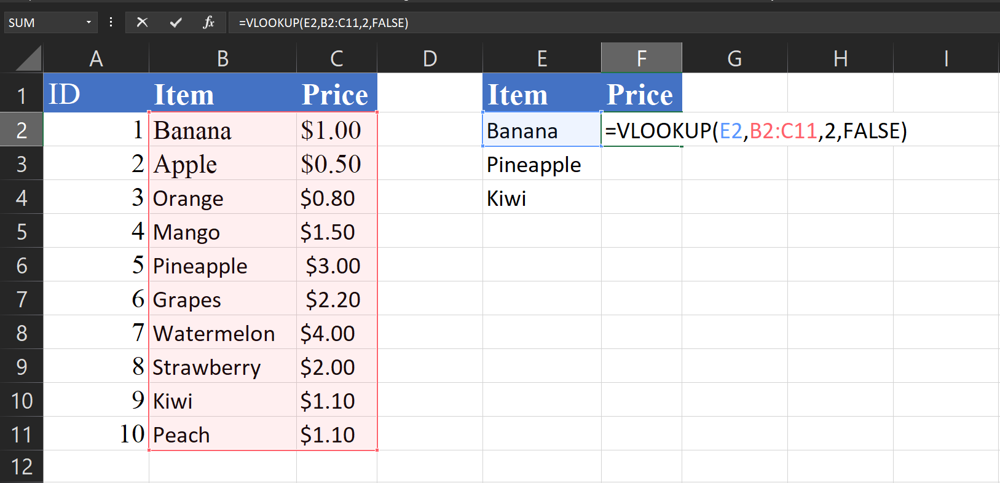

# Day 4: Lookup Functions (VLOOKUP, XLOOKUP)

## 1. The VLOOKUP Function
`VLOOKUP` (Vertical Lookup) searches for a value in the **first column** of a table and returns a value in the same row from a specified column.

**Syntax:**
```excel
=VLOOKUP(lookup_value, table_array, col_index_num, [range_lookup])
```

*   **lookup_value**: What you want to look up (e.g., a Product ID).
*   **table_array**: The range of cells containing the data (e.g., A2:C10).
*   **col_index_num**: The column number in the range containing the return value (1 for first column, 2 for second, etc.).
*   **range_lookup**: `FALSE` for exact match (most common), `TRUE` for approximate match.
*   0 is the numerical equivalent of FALSE.
*   1 is the numerical equivalent of TRUE.

**Example:**
Find the price of "Apple".

| **ID** | **Item** | **Price** |
|---|---------|---------|
| 1 | Apple   | $1.00   |
| 2 | Banana  | $0.50   |

```excel
=VLOOKUP(E2,B2:C11,2,FALSE)
```


*Result: $1.00*

---

## 2. The XLOOKUP Function
`XLOOKUP` is the modern, more powerful replacement for VLOOKUP. It can look in any direction (left or right) and defaults to exact match.

**Syntax:**
```excel
=XLOOKUP(lookup_value, lookup_array, return_array, [if_not_found], [match_mode], [search_mode])
```

*   **lookup_value**: What you want to look up.
*   **lookup_array**: The column/row to search in.
*   **return_array**: The column/row containing the value to return.
*   **if_not_found**: (Optional) What to show if no match is found (e.g., "Not Found").

**Example:**
Find the price of "Banana".
```excel
=XLOOKUP("Banana", A2:A3, B2:B3, "Not Found")
```

*Result: $0.50*

**Why XLOOKUP is better:**
*   Doesn't break if you insert columns.
*   Can look to the left (VLOOKUP can only look right).
*   Defaults to exact match (no need to type FALSE).

---

## Hands-on Practice: Step-by-Step

Copy these tables into Excel to practice.

### 1. VLOOKUP Practice
**Scenario:** Find the Department for specific Employee IDs.

**Data Table (A1:C5):**
| **ID** | **Name**    | **Dept**    |
|--------|-------------|-------------|
| 101    | Ahmed       | HR          |
| 102    | Sarah       | IT          |
| 103    | Bilal       | Sales       |
| 104    | Fatima      | Finance     |

**Task Table (E1:F3):**
|**Lookup ID** | **Dept?**  |
|----|------------|
| 102|            |
| 104|            |

*   **Goal:** Use VLOOKUP in F2 and F3 to find the Department.
*   **Formula for F2:** `=VLOOKUP(E2, A2:C5, 3, FALSE)`

*   **Expected Result:**
    *   102 -> IT
    *   104 -> Finance

### 2. XLOOKUP Practice
**Scenario:** Find the Salary based on Employee Name (Looking up, then returning value).

**Data Table (A1:C5):**
| **ID** | **Name**    | **Salary**  |
|--------|-------------|-------------|
| 101    | Ahmed       | 5000        |
| 102    | Sarah       | 7000        |
| 103    | Bilal       | 6000        |
| 104    | Fatima      | 8000        |

**Task Table (E1:F3):**
| **Name**   | **Salary?**|
|------------|------------|
| Bilal      |            |
| Zainab     |            |

*   **Goal:** Use XLOOKUP in F2 and F3. Handle missing names with "Not Found".
*   **Formula for F2:** `=XLOOKUP(E2, B2:B5, C2:C5, "Not Found")`

*   **Expected Result:**
    *   Bilal -> 6000
    *   Zainab -> Not Found

---
## End of Day 4

**Day 5 → Data Cleaning (Text functions, Duplicates)**


