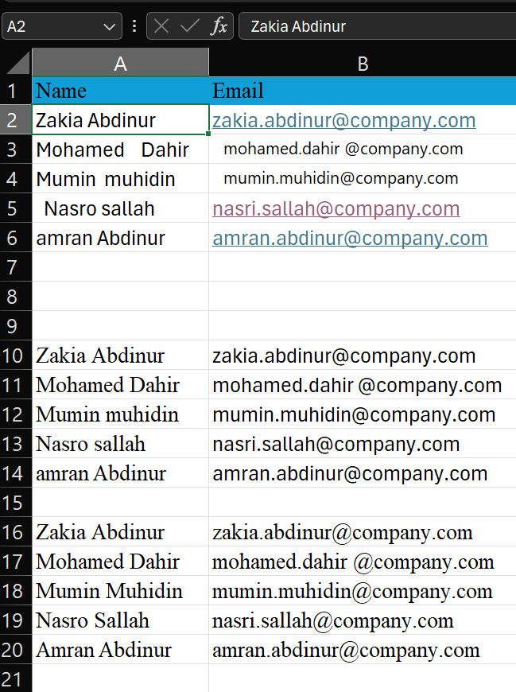

# Day 5: Data Cleaning (Text functions, Duplicates)

Data cleaning is 80% of a data analyst's job. Before you can analyze data, you must ensure it is clean, consistent, and free of errors.

## 1. Essential Text Functions
These functions help you manipulate and clean text strings.

### Basic Extraction
*   **LEFT(text, [num_chars])**: Extracts characters from the start (left) of a string.
    *   `=LEFT("A123", 1)` -> "A"
*   **RIGHT(text, [num_chars])**: Extracts characters from the end (right) of a string.
    *   `=RIGHT("A123", 3)` -> "123"
*   **MID(text, start_num, num_chars)**: Extracts characters from the middle.
    *   `=MID("A123-B", 2, 3)` -> "123"

### Formatting & Cleaning
*   **TRIM(text)**: Removes extra spaces (leading, trailing, and double spaces between words). **Crucial for cleaning imported data.**
    *   `=TRIM("  Hello   World  ")` -> "Hello World"
*   **PROPER(text)**: Capitalizes the first letter of each word.
    *   `=PROPER("john DOE")` -> "John Doe"
*   **UPPER(text) / LOWER(text)**: Converts text to all uppercase or lowercase.
    *   `=UPPER("text")` -> "TEXT"

### Combining Text
*   **CONCAT(text1, text2, ...)** or **&**: Joins text together.
    *   `=A2 & " " & B2` -> Joins First and Last Name with a space.

---

## 2. Finding & Replacing
*   **FIND(find_text, within_text)**: Returns the position number of a character. Case sensitive.
    *   `=FIND("@", "email@example.com")` -> 6
*   **LEN(text)**: Returns the total number of characters.
    *   `=LEN("Excel")` -> 5

**Pro Tip:** Combine `LEFT` and `FIND` to extract dynamic text (e.g., first name from a full name).
`=LEFT(A2, FIND(" ", A2) - 1)`

---

## 3. Removing Duplicates
Excel has a built-in tool to remove duplicate rows.

1.  Select your dataset.
2.  Go to the **Data** tab on the Ribbon.
3.  Click **Remove Duplicates**.
4.  Select which columns to check for duplicates (usually all of them for unique rows, or just "ID" for unique IDs).
5.  Click **OK**.

---

## 4. Flash Fill (Magic!)
Flash Fill automatically fills your data when it senses a pattern.

1.  Type the desired result in the column next to your data (e.g., typing "John" next to "John Doe").
2.  Type the second one ("Jane" next to "Jane Smith").
3.  Press **Ctrl + E**. Excel will fill the rest!

---

## Hands-on Practice: Step-by-Step

Copy this table into Excel (A1:B6).

| **Name**     | **Email** |
|--------------|-----------|
| `Zakia Abd inur` | zakia.abdinur@company.com |
| `Mohamed    Dahir` | mohamed.dahir  @company.com |
| `Mumin muhidin` | mumin.muhidincompany.com |
| `Nasri Sallah`  | nasri.sallah@company.com  |
| `amran Abdinur` | amran.abdinur@company.com |

### Tasks:
1.  **Clean Names**: Use formulas to create a "Clean Name" column.
    *   Remove spaces: `=TRIM(A2:B6)`
    *   Fix capitalization: `=PROPER(TRIM(A2:B6))`
2.  **Extract Username**: Extract the text before the "@" in the email.
    *   Formula: `=LEFT(B2, FIND("@", B2) - 1)`
3.  **Remove Duplicates**:
    *   Select the whole table.
    *   Data > Remove Duplicates.
    *   Notice that "Mohamed Dahir" appears twice (rows 2 and 5). If you select both columns, are they duplicates? (No, emails differ). If you select only "Raw Name", one will be removed.

---
## End of Day 5
**Day 6 → Pivot Tables Basics**

