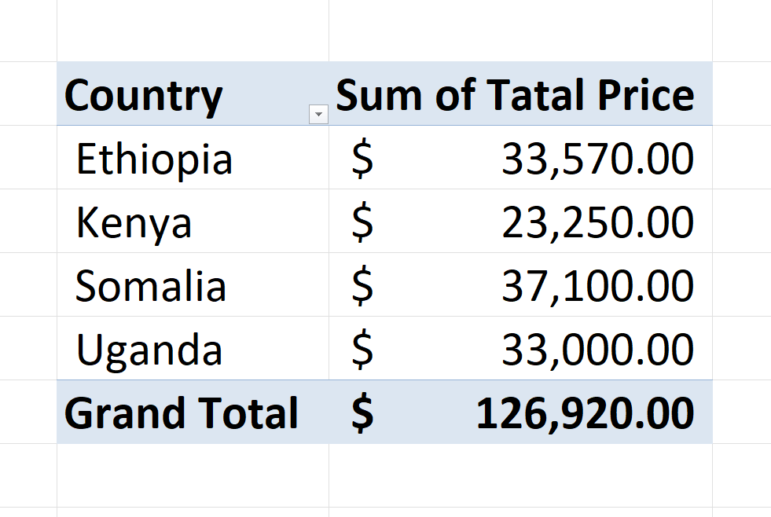

# Day 6: Pivot Tables Basics

Pivot Tables are one of the most powerful features in Excel. They allow you to summarize, analyze, explore, and present summary data from large datasets quickly.

## 1. Why use Pivot Tables?
Instead of writing complex formulas like `SUMIF` or `COUNTIF`, a Pivot Table can group and aggregate data with just a few clicks.

## 2. The Four Quadrants
When you build a Pivot Table, you drag fields into four areas:
1.  **Rows**: The categories you want to list down the side (e.g., City, Product).
2.  **Columns**: The categories you want across the top (e.g., Year, Region).
3.  **Values**: The data you want to calculate (e.g., Sum of Sales, Count of Orders).
4.  **Filters**: Fields to filter the entire report (e.g., Filter by SalesPerson).

---

## 3. Hands-on Practice: City Analysis

**Scenario**: Using the provided sales data, we want to analyze the total sales performance for each city.

### Data Source
The data consists of invoices with Date, Product, Units Sold, Unit Price, and Location info.
[View Data (CSV)](Dec6—PivotTablesBasics.csv)

### Analysis Result
By placing **City** in the **Rows** area and **TotalPrice** in the **Values** area (Sum), we get the following breakdown:

| City | Sum of Total Price |
| :--- | :--- |
| Addis Ababa | $33,570.00 |
| Kampala | $33,000.00 |
| Mogadishu | $37,100.00 |
| Nairobi | $23,250.00 |
| **Grand Total** | **$126,920.00** |

### Verification
The Grand Total of **$126,920.00** matches the control totals, confirming the analysis is correct.

