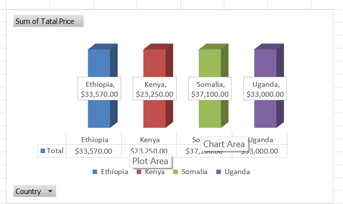
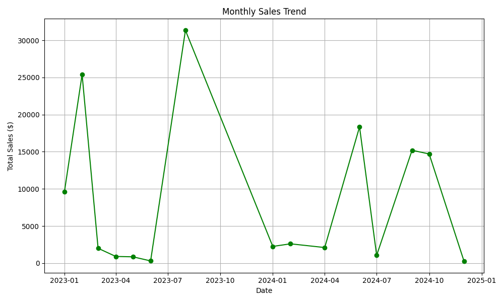
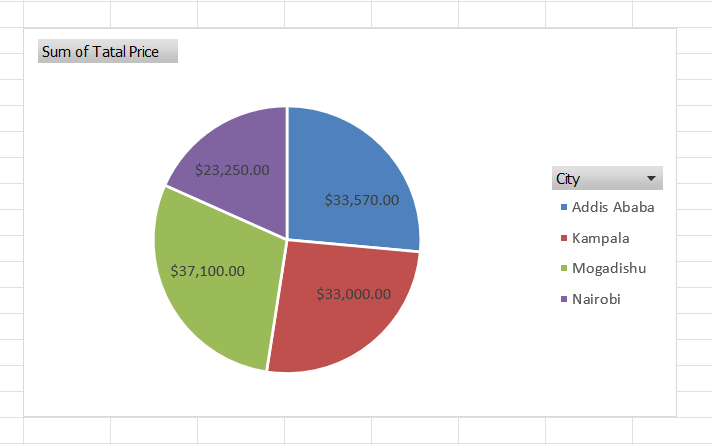

# Dec 7 — Charts & Visuals

Visualizing data is crucial for identifying trends, patterns, and outliers. Excel provides a wide range of chart types to help you tell a story with your data.

## 1. Preparing the Data

We will use the sales data from [View Data (CSV)](Dec6—PivotTablesBasics.csv). Ensure your data is clean and organized, with headers in the first row.

**Key Columns for Visualization:**
- **Product**: Categorical data for comparison.
- **Date**: Time-series data for trends.
- **TotalPrice**: Numerical data for values.
- **City/Country**: Categorical data for distribution.

## 2. Creating Charts

### A. Column Chart: Total Sales by Product
*Best for comparing values across categories.*

1.  **Select Data**: You might need to aggregate your data first (e.g., using a Pivot Table or `SUMIF` formulas) to get total sales per product.
    *   *Example Table*:
        *   Column A: Product Names (Laptop, Headphones, etc.)
        *   Column B: Total Sales
2.  Highlight the data range (including headers).
3.  Go to the **Insert** tab on the Ribbon.
4.  Click on the **Insert Column or Bar Chart** icon (usually the first one in the Charts group).
5.  Select **Clustered Column** (2-D Column).

### B. Line Chart: Sales Trend over Time
*Best for showing trends over time (days, months, years).*

1.  **Select Data**: Ensure you have a table with Dates and corresponding Sales amounts.
2.  Highlight the Date and Sales columns.
3.  Go to the **Insert** tab.
4.  Click on the **Insert Line or Area Chart** icon.
5.  Select **Line with Markers**.
    *   *Tip*: If your dates are daily, the chart might look cluttered. Consider grouping by Month in a Pivot Table first.

### C. Pie Chart: Sales Distribution by City
*Best for showing parts of a whole (percentage distribution).*

1.  **Select Data**: Use a summary table showing City and Total Sales.
2.  Highlight the City and Sales columns.
3.  Go to the **Insert** tab.
4.  Click on the **Insert Pie or Doughnut Chart** icon.
5.  Select **2-D Pie**.

## 3. Customizing Charts

Once a chart is created, you can customize it using the **Chart Design** and **Format** tabs (which appear when the chart is selected).

-   **Chart Title**: Click on the title to edit it. Make it descriptive (e.g., "Total Sales by Product (2023-2024)").
-   **Axis Labels**: Add labels to the X and Y axes to explain what they represent.
    *   *Chart Design > Add Chart Element > Axis Titles*.
-   **Data Labels**: Show the exact values on the chart elements.
    *   *Chart Design > Add Chart Element > Data Labels*.
-   **Legend**: Move or remove the legend if it's not needed or taking up too much space.
-   **Colors and Styles**: Use the *Chart Styles* gallery to quickly change the look and feel.

## 4. Best Practices

-   **Keep it Simple**: Avoid 3D charts as they can be hard to read.
-   **Sort Data**: For column/bar charts, sorting your data (e.g., highest to lowest) makes comparisons easier.
-   **Use Appropriate Scales**: Ensure your axis scales don't distort the data.

